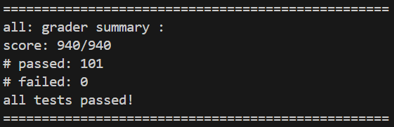
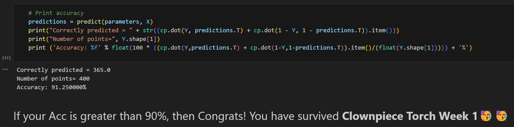

# Report of Clownpiece-torch Week 1

## 通过记录

- `grade_all.py`

- `grade_comprehensive.ipynb`

---

## 总结

非常良心且易于调试的项目，使我开心通过。非常好学长，耐心回答我愚蠢的问题。尽量回顾一些遇到的困难：

1. 写构造函数时，部分 `storage_` 的构造需要确定 `size`，为了能在初始化列表中完成构造，我将 `numel_` 和 `shape_prod_` 的计算提前，而提前的方法就是把 `shape_prod_` 的顺序塞到前面去，虽然这一方法很奇怪，但是顺利完成了任务。

2. 实现 `clone` 时，没有关注到构造时写了浅拷贝，所以懵逼了一会儿。

3. `scatter_` 部分之前一直无法理解，多隔几天 + 询问学长 + 反复阅读文档，似乎是解决了吧。

4. 在写前面的时候，发现无法测试，查出来是因为测试点要用后面的函数。补充了实现，或者暂时跳过对应测试就解决了。

5. `Shape Manipulation` 部分只能说越写，我对 `stride` 还有 `offset` 的理解就越深，而且这部分作用很大，所以我写的顺序是 Part 1-2-3-4-7-5-8-6。

6. 一开始不会测 `grade_comprehensive.ipynb`，在学长和 ai 的帮助下弄好了。

7. 自己造学长忘记造的 `scatter_` 和列表版本的 `broadcast`，一个是 torch 要求 index 的 `dtype=torch.long`，一个是列表参数填入方式不同，因此都需要选择结构分开处理。（其实加这条是为了 commit 好看）

8. 别的没啥了，基本上输出调试一下就能找出来，而且每次都是先挂第一个点，修完了之后就全过了，从来没这么爽过。

启示：选择大于努力，无论是选择写项目的顺序，还是我选择了这个项目（赞）。