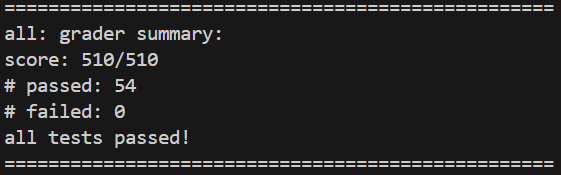
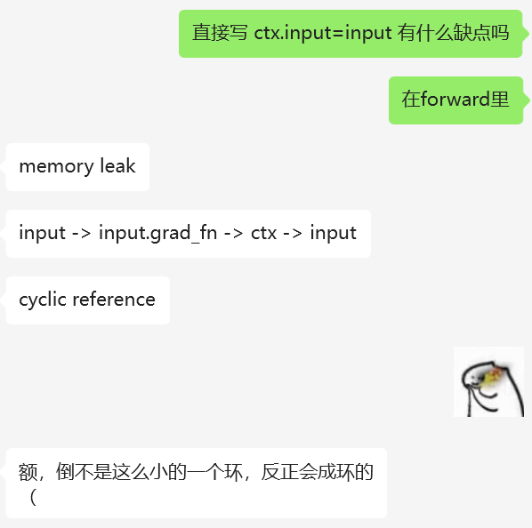

# Report of Clownpiece-torch Week 2

## 通过记录

- `grade_all.py` + `single_thread`

I added an additional test in `grade_part5.py`.

- `grade_all.py` + `multi_thread`

It can only pass randomly now and has not been fixed yet. :( :$ :@

## 问题回答

> **Why we cannot use `while queue is not empty` as exit condition directly in multithreading case?**

如果某个线程检查到队列非空，但在它真正取出数据前，另一个线程将元素取走导致队列为空，导致它尝试 `pop()` 空队列，从而抛出异常或进入死循环，即这个条件无法在多个线程之间保持一致，而应该采用带锁的同步机制。

> **Why multithreading in backward execution matters, even if there is operator level multithreading?**

算子级多线程只能加速单个操作，但是不能加速整个计算图的计算。在复杂的计算图中，很多梯度节点是彼此独立的，能够同时进行反向传播，这些并行路径如果只用单线程调度，会造成资源浪费。在反向传播过程引入多线程，能更好地利用多核 CPU 资源，缩短整个 backward 的总执行时间，提升模型训练效率。

---

## 总结

随着 c++ 部分的远去，python 的语法特性和一些奇怪的问题，让我这周写的格外的郁闷。

在开始的头两天，我反复尝试理解程序的执行顺序，总归是有了个感觉（但是现在让我说清楚还是不太行）。接着，我按照代码里的 guidance 写而不求甚解，在第一个 `clone` 测试时就疯狂报错。于是我边修边学，在修掉了所有报错之后，test failed 了。

自己查错终究是无果的，还好有善良的 TA 一眼指出错误：

相关的用法也有：

总算是处理完了一些基本的问题，大致把握了整体的方向。

然后迎来了我最郁闷的 5 号的凌晨，几个小时都以为是建图之类的错了，反复改了几个细节都不知道为什么 `grad` 的类型是 `mul` 而不是 `None`。中午起床后，经过和 TA 的一番交流，锅甩给了 `ones` 的默认参数。经过 TA 不懈的努力 fix 了 bug 后，问题也赢来了解决。

6 号只剩下类似的 backward 的推进，有了先前的经验后问题大多迎刃而解，除了 `scatter_` 这个 in-place 修改造成了一点困扰，缝缝补补就过去了。

最后就该填坑了，也就是最初只写了 `single_thread` 的部分，要完成 `multi_thread`。我本身并不太会用锁，更何况在 python 里。然后就去拷打了 ai，跑出来的结果相当随机。一路顺藤摸瓜也不知道何处有错，请教了耐心的 TA 后，得知也是一处需要 fix 的 bug。为了不耽误后面的进度，我就先放着了。 :O

总之还是感谢 TA 的指导，没有他们的耐心解答与负责，我也写不到这一行（