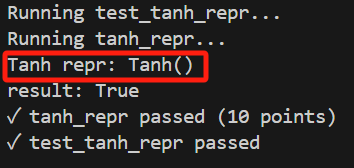
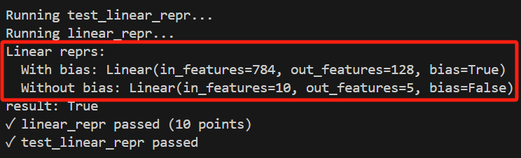
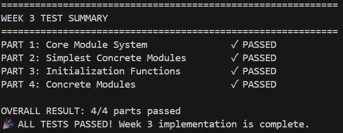

# Report of Clownpiece-torch Week 3

## 通过记录

### 1. Output of `__repr` test in `grade_part1.py`

 

### 2. The grader summary part from output of `grade_all.py`

## 经验与教训

这周做的比较狼吞虎咽，心急于完成 basic 后去做选做而导致了一堆弱智错误。

1. 在运行测试时，时常会 raise 一些不支持 tuple 之类的错，一般是想当然在 `reshape` 时用的圆括号而不是方括号导致的。
2. 在运行测试时，发现有些函数的传入参数没有默认值，如 `transpose()` 的 `dim0` 和 `dim1`，在修改 `tensor.py` 后得到了解决。
3. 在测试 `Embedding` 时发现 `__getitem__` 方法不支持单维 tensor 作为索引，在修改 `tensor.py` 后得到了解决。
4. 在测试 `MSELoss` 时发现 `forward` 方法中写成 `y = x * x` 形式会报错，而写成 `y = x.pow(2)` 形式可以通过。在倒查 week2 的部分中，发现再往前一步传入为 `(x.grad, None)` 而非 `x.grad`，经过在 `tests/week2/grade_part3.py` 中额外添加 `extra` 测试后最终定位错误在建图环节，发现我错误地将入度作为 node 的 input_buffer 的大小，更改标准为 `max(input_nr) + 1` 后得到了解决。
5. 在测试 `tests/week3/estate_value_predict/main.ipynb` 时，发现 test loss 最终为 0.046，距离 0.01 较远。根据 Exploratory Task 的提示，我将 hidden feature 的大小扩大一倍，test loss 进步到 0.028（有一定波动），再将学习率 `init_lr` 逐渐增大，发现 test loss 最终能达到 0.008 左右，且测试损失迅速衰减。但是过大时导致模型训练不稳定，后期呈现波动式上升。
6. 在测试  `tests/week3/mnist/main.ipynb` 时，报错 `TypeError:Tensor.reshape() got multiple values for argument 'Functionclass'`，在起初我一直不明白哪里会重复传参，反复问了 ai 也不明白，而且 ai 给的建议甚至需要大幅度更改底层逻辑。在被 TA 骂醒之后，我猛然发现有一行 `View as a scrollable element or open in a text editor: Adjust cell output settings.`，才发现报错信息过长被折叠了 :(，只要展开之后就能看到完整内容，然后我就迅速发现是 `MultiheadAttention` 里犯了 1. 里面提到的错误，再加上另一个忘记改的变量名就解决了。
7. 接上条，能够正常运行后，我发现模型准确率维持在奇低的水平且无法进步，猜测是损失函数写错了。经检查，`CrossEntropyLoss` 中 `forward` 的实现方法丢失了梯度，经过~~亡羊补牢~~修正之后，模型准确率开始大幅攀升，最终基本达到了目标。此外，同 5. 提到的增加初始学习率的方式，模型初期上升速率提高，经测试 0.08 是一个较为合适的值，既保证了初期的速度，又保证了后期的稳定。

总的来说，经历了 week3 的锤炼与洗礼，我算是知道了如何搭建一个小型的模块系统，用于深度学习，也算是对 Python 更加熟悉了。这周的挫折主要还是告诉我要沉下心去看报错信息，不能太急于求成了。

## Optional Challange: Add Support for Conv2d

To be completed...