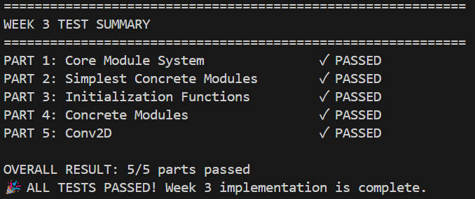

# Report of Clownpiece-torch Week 3

## 通过记录

### 1. Output of `__repr` test in `grade_part1.py`

 

### 2. The grader summary part from output of `grade_all.py`


And after adding an extra test for `Conv2D`...



## 经验与教训

这周做的比较狼吞虎咽，心急于完成 basic 后去做选做而导致了一堆弱智错误。

1. 在运行测试时，时常会 raise 一些不支持 tuple 之类的错，一般是想当然在 `reshape` 时用的圆括号而不是方括号导致的。
2. 在运行测试时，发现有些函数的传入参数没有默认值，如 `transpose()` 的 `dim0` 和 `dim1`，在修改 `tensor.py` 后得到了解决。
3. 在测试 `Embedding` 时发现 `__getitem__` 方法不支持单维 tensor 作为索引，在修改 `tensor.py` 后得到了解决。
4. 在测试 `MSELoss` 时发现 `forward` 方法中写成 `y = x * x` 形式会报错，而写成 `y = x.pow(2)` 形式可以通过。在倒查 week2 的部分中，发现再往前一步传入为 `(x.grad, None)` 而非 `x.grad`，经过在 `tests/week2/grade_part3.py` 中额外添加 `extra` 测试后最终定位错误在建图环节，发现我错误地将入度作为 node 的 input_buffer 的大小，更改标准为 `max(input_nr) + 1` 后得到了解决。
5. 在测试 `tests/week3/estate_value_predict/main.ipynb` 时，发现 test loss 最终为 0.046，距离 0.01 较远。根据 Exploratory Task 的提示，我将 hidden feature 的大小扩大一倍，test loss 进步到 0.028（有一定波动），再将学习率 `init_lr` 逐渐增大，发现 test loss 最终能达到 0.008 左右，且测试损失迅速衰减。但是过大时导致模型训练不稳定，后期呈现波动式上升。
6. 在测试  `tests/week3/mnist/main.ipynb` 时，报错 `TypeError:Tensor.reshape() got multiple values for argument 'Functionclass'`，在起初我一直不明白哪里会重复传参，反复问了 ai 也不明白，而且 ai 给的建议甚至需要大幅度更改底层逻辑。在被 TA 骂醒之后，我猛然发现有一行 `View as a scrollable element or open in a text editor: Adjust cell output settings.`，才发现报错信息过长被折叠了 :(，只要展开之后就能看到完整内容，然后我就迅速发现是 `MultiheadAttention` 里犯了 1. 里面提到的错误，再加上另一个忘记改的变量名就解决了。
7. 接上条，能够正常运行后，我发现模型准确率维持在奇低的水平且无法进步，猜测是损失函数写错了。经检查，`CrossEntropyLoss` 中 `forward` 的实现方法丢失了梯度，经过~~亡羊补牢~~修正之后，模型准确率开始大幅攀升，最终基本达到了目标。此外，同 5. 提到的增加初始学习率的方式，模型初期上升速率提高，经测试 0.08 是一个较为合适的值，既保证了初期的速度，又保证了后期的稳定。

总的来说，经历了 week3 的锤炼与洗礼，我算是知道了如何搭建一个小型的模块系统，用于深度学习，也算是对 Python 更加熟悉了。这周的挫折主要还是告诉我要沉下心去看报错信息，不能太急于求成了。

## Optional Challange: Add Support for Conv2d

> **How do you implement `Conv2d`?**

我首先在 `clownpiece/tensor/tensor.cc` 里用 C++ 实现了 `unfold` 和 `fold`，然后在 `clownpiece/tensor/tensor_pybind.cc` 中将其在 Python 中绑定。完成这些操作之后，我自己编写了测试点 `tests/week1/grade_part9.py`，并与 torch 对比并调试至了通过。

然后我在 `clownpiece/autograd/function.py` 里实现了 `Unfold` 类的前向和反向传播（反向传播使用 `fold`），并在 `clownpiece/tensor.py` 中补充了相应操作。完成之后，我自己编写了测试点 `tests/week2/grade_part7.py`，并与 torch 对比并调试至了通过。

最后我在 `clownpiece/nn/layers.py` 中添加了 `Conv2D` 模块，用 AI 生成了测试点 `tests/week3/grade_part5.py` 并获得通过。

核心思想为：用 `unfold` 将输入张量的每一个卷积窗口展平，然后把卷积核相应做调整，运用矩阵乘法来做卷积，最后再重塑成输出形状。

核心代码如下：

```python
def forward(self, x: Tensor) -> Tensor:
    unfolded = x.unfold(self.kernel_size) # (N, C_in * kh * kw, L)
    kernel_weight = self.weight.reshape([self.out_channels, -1]) # (C_out, C_in * kh * kw)
    
    output = kernel_weight @ unfolded # (N, C_out, L)
    
    batch_size, _, height, width = x.shape
    out_height = height - self.kernel_size[0] + 1
    out_width = width - self.kernel_size[1] + 1
    
    output = output.reshape([batch_size, self.out_channels, out_height, out_width]) # (N, C_out, H_out, W_out)
    
    if self.bias:
      output += self.bias.view([1, -1, 1, 1])
    
    return output
```

> **- What's the exact semantic of `unfold` and it's backward? How can it be utilized in `Conv2d`?**

<blockquote style="background-color:Yellow; color:Red;">
  Warning: 执笔至此，笔者才发现一个灾难性的错误：要求实现的是 padding='same'，可我始终将其简化为 padding=0 看待。因此上述代码仍需添加新功能，而这次 report 也仅作阶段性的汇报，后续仍会进行补充。
</blockquote>

`unfold` 操作的核心思想是从输入张量中提取出所有可能的、指定大小的滑动窗口（patches），并将这些窗口展平成一维向量，然后将所有展平后的窗口堆叠起来形成一个新的张量。

以一个 2D 张量为例，`unfold` 会沿着高度和宽度维度滑动一个窗口。对于每个窗口位置，窗口内的数据会被展平。最终，这些展平后的窗口向量会组成一个新的 2D 张量，其中一行代表一个展平后的窗口。

`unfold` 的反向操作通常被称为 `fold`，它的作用是将 `unfold` 产生的展平后的窗口重新组合成原始形状或根据卷积操作的输出形状，它的输入通常是形状为 $(N, C_{in} \times k_H \times k_W, L)$ 的张量，输出是形状为 $(N, C_{out}, H_{out}, W_{out})$ 的张量，其中 $C_{out}$ 是期望的输出通道数，$H_{out}$ 和 $W_{out}$ 是期望的输出高度和宽度。

`Conv2d` 操作可以通过以下步骤利用 `unfold` 来实现：

1.  用 `unfold` 将输入张量展开成形状为 $(N, C_{in} \times k_H \times k_W, L)$ 的矩阵。矩阵储存着所有窗口对应的展平后的局部感受野。
2.  将 `Conv2d` 层的卷积核（权重）重塑成一个 $2D$ 矩阵。如果卷积核的形状是 $(C_{out}, C_{in}, k_H, k_W)$，它会被重塑为 $(C_{out}, C_{in} \times k_H \times k_W)$。
3.  对 `unfold` 的输出张量与重塑后的卷积核进行矩阵乘法，即这相当于将每个展平的感受野与所有输出通道的卷积核进行点积操作。
    例如，如果 `unfold` 的输出是 `unfolded_input`，卷积核是 `weights_reshaped`，那么计算可以表示为：`output_matrix = weights_reshaped @ unfolded_input`，形状是 $(N, C_{out}, L)$。
4.  将最后一维重塑成两维。如果 `Conv2d` 层有偏置项，则将其添加到最终的输出张量中。

查阅资料后得知，如此实现是因为矩阵乘法是高度优化的操作，许多深度学习框架都依赖于底层的 BLAS (Basic Linear Algebra Subprograms) 库（如 cuBLAS for NVIDIA GPUs, MKL for Intel CPUs）来实现高效的并行计算。通过将卷积操作转化为矩阵乘法，可以充分利用这些优化。