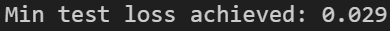

# Report of Clownpiece-torch Week 4

## 通过记录

### 1. The grader summary part from output of `grade_all.py`

### 2. estate_value_predict

### 3. fashion_mnist

## 总结

在最后一周，我完成了深度学习库的周边工具开发，主要包括以下几个方面：

- **数据加载工具**：实现了 `Dataset`、`CSVDataset`、`ImageDataset`、`Dataloader` 以及图像变换等功能。这些工具使得我们能够方便地加载和处理各种类型的数据。
- **优化算法**：实现了 `Optimizer` 基类，并基于此实现了 `SGD` 和 `Adam` 两种优化算法。优化算法是深度学习中调整模型参数的关键。
- **学习率调度器**：实现了 `LRScheduler` 基类，以及 `LambdaLR`、`ExponentialLR`、`StepLR` 等具体的学习率调度器。学习率调度器可以根据训练的进展动态调整学习率，有助于提高模型的训练效果和收敛速度。

有了前几周的教训与经验，这周的调试比较轻松，会出问题的一般都是浅拷贝之类的，这些也比较好发现。最主要的问题是默认的 `collate_fn` 的实现方式，我在翻阅了官方文档和 torch 源码后，决定从简处理。在我的很多实现中，会存在 `raise Error` 不足的问题，在一定程度上会导致输入不合法参数却没有被及时中止，而导致盲目训练造成的资源浪费，这个是后续需要改进之处。

在上周的最终测试里，我对学习率没有什么深刻的了解，只知道初始学习率调高了收敛特别快，但是后期更容易波动。在这周的实现中，我详细地知道了学习率决定了损失函数的梯度对参数的更新幅度，而初始阶段需要较大的学习率快速探索参数空间，后期则需要较小的学习率精细调整以收敛到最优解。因此，需要通过学习率调度器进行适当调整，而这整个过程都需要调参。

不同的优化算法效果也不同。从简单的随机梯度下降，到加入权重衰减来防止过拟合，再到引入动量项用于累计历史梯度信息从而减少震荡加速训练，最终形成兼顾速度和泛化能力的优化算法。

而 Adam 通过同时估计梯度的均值和方差，一阶矩（均值）类似于 SGD 中的动量，而二阶矩（方差）则可以自适应调整每个参数的学习率。为了解决训练初期一阶矩和二阶矩的估计偏差，引入偏差校正机制，从而在训练初期也能获得较为准确的参数更新。

对比二者，SGD 调参难度更大，收敛速度也更慢，但是由于权重衰减的引入，模型的泛化能力会更强。

通过本周对优化算法和学习率调度器的深入学习与实践，我深刻认识到它们在深度学习模型训练中的关键作用，而合理选择和调整这些组件将直接影响模型的训练效率和性能表现。