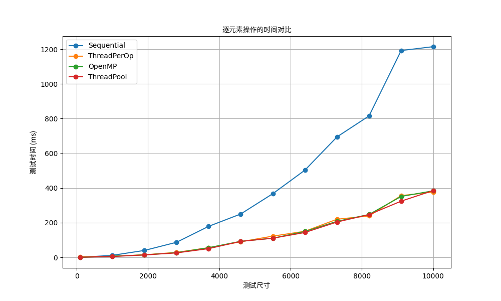
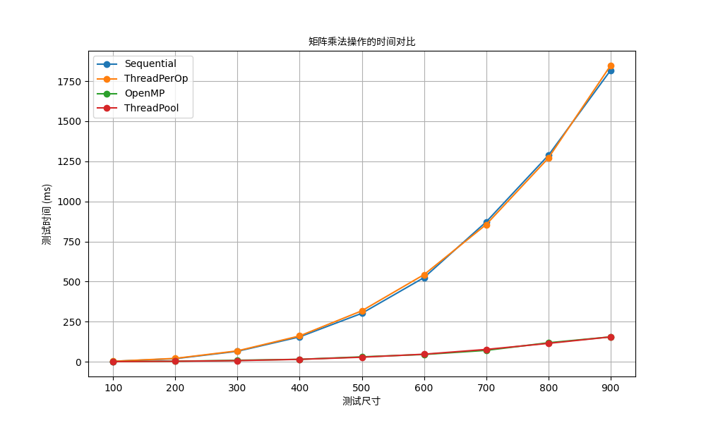
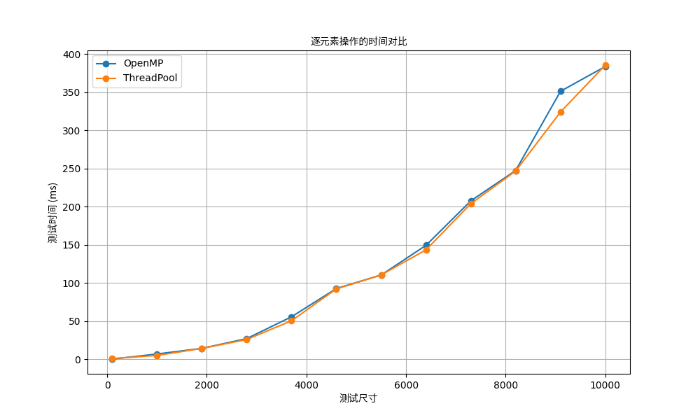
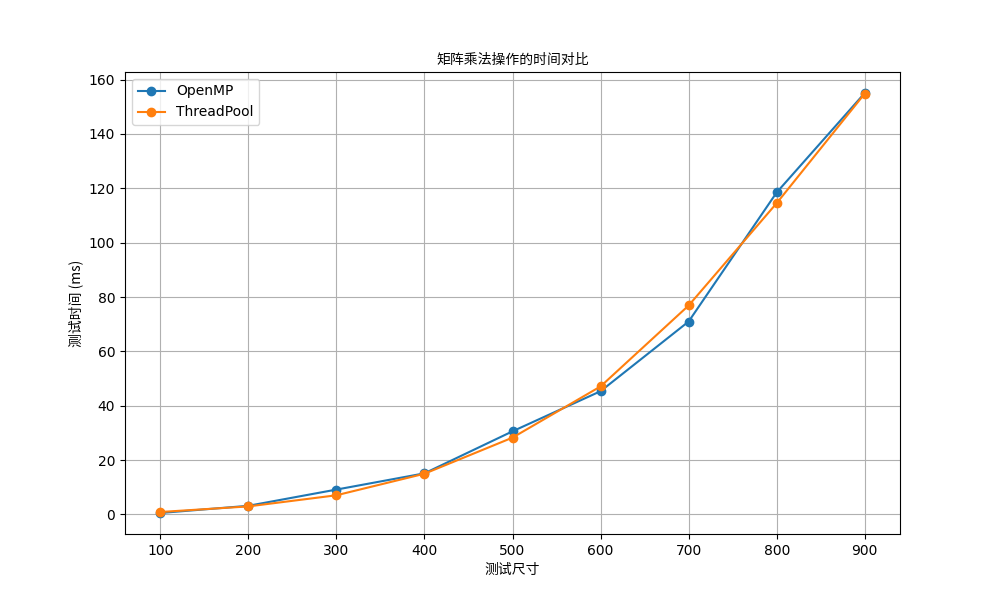
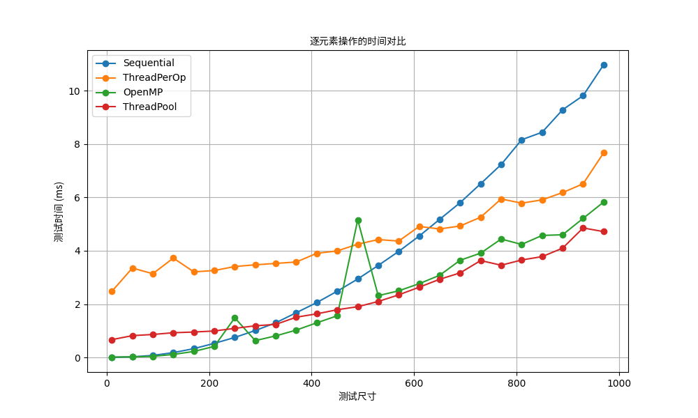

# Report of Clownpiece-torch Week 5 (Week 1 - OC)

## Description

> **Q1: How you implemented and optimized each method?**

为了在不同并行策略间切换，代码实现中使用了编译时宏定义（如 `USE_OPENMP`, `USE_THREAD_POOL` 等）。默认情况下，不带任何宏定义的编译将生成顺序执行版本。

### Element-wise Operation

下以 `apply_binary_op` 函数的实现为例，`apply_unary_op` 同理。

**1. Thread-per-Operation**

为了避免在数据量巨大时创建过多线程导致程序崩溃，对每个操作的底层实现采用分块策略：将元素总数 `num_elements` 按照硬件线程数进行分块，为每个数据块的计算创建一个新线程。

```cpp
unsigned int num_threads = std::thread::hardware_concurrency();
std::vector<std::thread> threads;
int chunk_size = (num_elements + num_threads - 1) / num_threads;

for (unsigned int t = 0; t < num_threads; ++t) {
  int start = t * chunk_size;
  int end = std::min(start + chunk_size, num_elements);
  if (start < end) {
    threads.emplace_back([&, start, end]() {
      for (int i = start; i < end; i++) {
        data[i] = op(LHS.data_at(i), RHS.data_at(i));
      }
    });
  }
}
for (auto& thread : threads) {
    thread.join();
}
```

**2. Implicit Parallelism**

使用 OpenMP 的 `parallel for` 指令，让编译器自动对循环进行并行化。这种方法对代码侵入性最小。

```cpp
#pragma omp parallel for
for (int i = 0; i < num_elements; i++) {
  data[i] = op(LHS.data_at(i), RHS.data_at(i));
}
```

**3. Thread Pool**

与 Thread-per-Operation 类似，将任务分块，但提交给一个预先创建好的全局线程池，从而复用线程，避免了重复创建和销毁的开销。

```cpp
unsigned int num_threads = pool.get_thread_count();
int chunk_size = (num_elements + num_threads - 1) / num_threads;

for (unsigned int t = 0; t < num_threads; ++t) {
  int start = t * chunk_size;
  int end = std::min(start + chunk_size, num_elements);
  if (start < end) {
    pool.detach_task([&, start, end]() {
      for (int i = start; i < end; i++) {
          data[i] = op(LHS.data_at(i), RHS.data_at(i));
      }
    });
  }
}
pool.wait();
```

### Matrix Multiplication

**1. Thread-per-Operation**

为批处理中的每一个矩阵的乘法运算创建一个新线程。

```cpp
std::vector<std::thread> threads;
threads.reserve(num_batches);
for (int s = 0; s < num_batches; s++) {
  threads.emplace_back([s, n, l, m, &lhs_tens, &rhs_tens, &mat_tens]() {
    Tensor LHS = lhs_tens[s], RHS = rhs_tens[s], MAT = mat_tens[s];
    for (int i = 0; i < n; i++) {
      for (int j = 0; j < l; j++) {
        dtype sum = 0;
        for (int k = 0; k < m; k++) {
          sum += LHS.data_at(i * m + k) * RHS.data_at(j * m + k);
        }
        MAT.data_at(i * l + j) = sum;
      }
    }
  });
}
for (auto& t : threads) {
    t.join();
}
```

**2. Implicit Parallelism**

这里我将最外层的批次数视为已知，对内层 `(i,j)` 的循环并行，以加细线程粒度。

```cpp
for (int s = 0; s < num_batches; s++) {
  Tensor LHS = lhs_tens[s], RHS = rhs_tens[s], MAT = mat_tens[s];
  #pragma omp parallel for collapse(2)
  for (int i = 0; i < n; i++) {
    for (int j = 0; j < l; j++) {
      dtype sum = 0;
      for (int k = 0; k < m; k++) {
        sum += LHS.data_at(i * m + k) * RHS.data_at(j * m + k);
      }
      MAT.data_at(i * l + j) = sum;
    }
  }
}
```

**3. Thread Pool**

这里我做了分块优化，将每个矩阵乘法任务分割为 32x32 的小块，并将每个块的计算作为一个任务提交到线程池，以加细线程粒度。

```cpp
int chunk_size = 32;
for (int s = 0; s < num_batches; s++) {
  Tensor LHS = lhs_tens[s];
  Tensor RHS = rhs_tens[s];
  Tensor MAT = mat_tens[s];

  for (int i = 0; i < n; i += chunk_size) {
    for (int j = 0; j < l; j += chunk_size) {
      pool.detach_task([=, &LHS, &RHS, &MAT]() {
        for (int ii = i; ii < std::min(i + chunk_size, n); ii++) {
          for (int jj = j; jj < std::min(j + chunk_size, l); jj++) {
            dtype sum = 0;
            for (int k = 0; k < m; k++) {
              sum += LHS.data_at(ii * m + k) * RHS.data_at(jj * m + k);
            }
            MAT.data_at(ii * l + jj) = sum;
          }
        }
      });
    }
  }
}
pool.wait();
```

> **Q2: Your test setup (CPU specs, dataset size, time measuring method, thread number etc.)**

```
CPU(s):                             32
Thread(s) per core:                 2
Core(s) per socket:                 16
Model name:                         AMD Ryzen 9 7945HX with Radeon Graphics
Description:                        Ubuntu 20.04.6 LTS
g++ version:                        g++ (Ubuntu 9.4.0-1ubuntu1~20.04.2) 9.4.0
Thread number:                      32
```

测试逐元素操作时，采用大小为 `[size, size]` 的 tensor 并应用运算 `y = x * 2 + 3`，执行 `TIMING_RUNS` 次取平均。

测试矩阵乘法操作时，采用大小为 `[size, size]` 的 tensor 并应用运算 `C = A @ B`，执行 `TIMING_RUNS` 次取平均。

测试程序 `clownpiece/tensor/test_performance.py` 如下：

```python3
import time
import tensor_impl as Tensor
import threading
from concurrent.futures import ThreadPoolExecutor

# --- 测试配置 ---
SIZES_TO_TEST_OP = [i for i in range(100, 10001, 900)] 
SIZES_TO_TEST_MAT = [i for i in range(100, 1000, 100)] 
WARMUP_RUNS = 1
TIMING_RUNS = 5

# # --- 调试配置 ---
# SIZES_TO_TEST_OP = [i for i in range(100, 1000, 100)] 
# SIZES_TO_TEST_MAT = [i for i in range(100, 1000, 100)] 
# WARMUP_RUNS = 1
# TIMING_RUNS = 1

def time_operation(op_name, op_lambda, size_info):
    
    """一个通用的计时函数"""
    # 1. 预热
    for _ in range(WARMUP_RUNS):
        op_lambda()
    
    # 2. 计时
    start_time = time.perf_counter()
    for _ in range(TIMING_RUNS):
        op_lambda()
    end_time = time.perf_counter()
    
    # 3. 计算并打印结果
    avg_duration_ms = ((end_time - start_time) / TIMING_RUNS) * 1000
    print(f"  - {op_name:<25} @ {size_info:<15}: {avg_duration_ms:.4f} ms")

def main():
    print("="*60)
    print(f"开始性能测试 ({Tensor.parallel_strategy()})")
    print("="*60)

    for size in SIZES_TO_TEST_OP:
        print(f"\n--- 测试尺寸: {size}x{size} ---")
        x = Tensor.randn([size, size])
        elementwise_op = lambda: x * 2.0 + 3.0
        time_operation("Element-wise (y=x*2+3)", elementwise_op, f"{size}x{size}")
    
    for size in SIZES_TO_TEST_MAT:
        print(f"\n--- 测试尺寸: {size}x{size} ---")
        a = Tensor.randn([size, size])
        b = Tensor.randn([size, size])
        matmul_op = lambda: a @ b
        time_operation("Matrix Multiplication", matmul_op, f"{size}x{size}")

    print("\n" + "="*60)
    print("测试完成")
    print("="*60)

if __name__ == "__main__":
    main()
```

为避免频繁在命令行中切换编译指令，编写了脚本 `clownpiece/tensor/run_all.sh`，可以依次编译原始版本和三种多线程版本，并将结果统一输出到一个指定文件内。`clownpiece/tensor/graph.py` 则用于从文件中读取信息，能够根据测试的标识归类数据，并最终绘制两个图片。

## Benchmark results




去掉 Sequential 和 ThreadPerOp 后绘制的图表如下：



## Analysis

> **Q3: Which method performed best in general and why?**

总体上，`ThreadPool` 和 `OpenMP` 的性能最好。
  - 对于元素级运算：`ThreadPool` 表现最佳。从图 1 可以看出，它的性能曲线一直处于最下方，且增长平滑。
  - 对于矩阵乘法：`ThreadPool` 和 `OpenMP` 表现旗鼓相当，性能曲线几乎完全重合，都取得了数十倍甚至上百倍的性能提升。

原因分析：
1.  高效的线程管理：`ThreadPool` 和 `OpenMP` 都避免了频繁地创建和销毁线程。它们维护一个长期存在的线程组，极大地降低了线程管理的开销。
2.  开销对比：与此相反，`Thread-per-Operation` 方法每次计算都需要创建新线程，完成后再销毁。这种开销在计算任务本身很简单（如元素级运算）或执行次数极多（如矩阵乘法的小任务）时，会变得无法接受，导致其性能甚至不如单线程的顺序版本。图 1 和图 2 中 `ThreadPerOp` 的糟糕表现印证了这一点。
3.  实现的成熟度：`OpenMP` 是一个非常成熟的并行计算标准，其由编译器提供的实现经过了高度优化，能高效地处理循环并行这类经典场景。

> **Q4: At what point does parallelization overhead outweigh the benefits? Based on this knowledge, can you vary number of thread according to task scale to achieve better performance?**

对比元素级操作和矩阵乘法，我们可以得出：并行开销在任务规模过小的时候会超过收益。（当然，在图 1 中，由于我对元素级操作进行了分块操作，必然是将开销优化得更小了的）

为了更清晰地看到元素级操作的临界点，我更改配置为
```python3
SIZES_TO_TEST_OP = [i for i in range(10, 1000, 40)] 
TIMING_RUNS = 10
```

绘制结果如下：


  - 临界点分析：从图中可以清晰地看到，`Thread-per-Operation` 的临界点在 600 附近，而对于性能更好的 `ThreadPool`，临界点在 300 附近。`OpenMP` 由于编译器内部高度优化等其他原因，并行调度、任务分发和最终同步结果的开销被大幅降低，在规模较小时仍能与单线程持平。
  - 动态调整线程数：`OpenMP` 似乎做的非常不错，那我们直接把线程给满即可（大雾）。在特殊场景下，超低量级的运算可以调成单线程，然后随数据规模逐渐增大，充分利用各级优势。

> **Q5: For which operation(s) is parallelization most beneficial?**

矩阵乘法从并行化中受益最多。受益的多少取决于任务中算术操作次数与内存访问量的比值。

以一个 $n\times n$ 的二维 tensor 为例：

1.  元素级运算：计算复杂度为 $O(n^2)$，访存量也为 $O(n^2)$。每个从内存中读取的数据只参与一次乘法和一次加法，其计算密度较低。
2.  矩阵乘法：计算复杂度为 $O(n^3)$，而访存量为 $O(n^2)$。这意味着每个从内存读取的数据会被重复用于多次计算（在标准的矩阵乘法中是 $n$ 次乘加）。$n$ 越大，其计算密度越高。

高计算密度的任务意味着线程大部分时间都忙于计算，而不是等待数据，因此并行执行带来的加速效果会非常显著。

## 附录：测试使用方法

首先切换到子目录 `clownpiece/tensor` 下，运行 `bash run_all.sh`，待 "所有测试完成，结果已写入 xxx" 字样出现后，将 `graph.py` 中的读入路径相应的更改，然后运行 `python3 graph.py` 即可绘图。

可修改的参数：

- `test_performance.py`：
  - 元素级操作规模的列表 `SIZES_TO_TEST_OP`
  - 矩阵乘法操作规模的列表 `SIZES_TO_TEST_MAT`
  - 程序预热轮次 `WARMUP_RUNS`
  - 程序执行轮次 `TIMING_RUNS`

- `run_all.sh`：输出文件 `OUTFILE`

- `graph.py`：
  - 读入路径 `file_path`，这个应与 `run_all.sh` 中的 `OUTFILE` 保持一致。
  - 绘图对象 `patterns`，哪个实现方法无需绘图，就注释那一行。